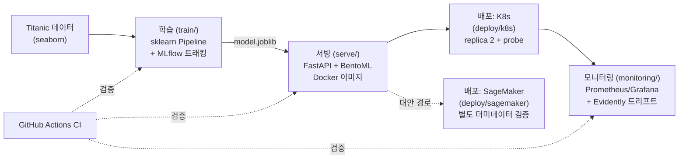

<title>W10 · MLOps 포트폴리오 #1 — Titanic End-to-End 파이프라인</title>

# Titanic MLOps 파이프라인 (포트폴리오 #1)

> MLOps 24주 학습 계획 W1~W9의 산출물을 하나의 저장소로 통합한 End-to-End 파이프라인.
> 새 개념보다 **"연결"과 "왜 이렇게 설계했나"**에 초점을 맞췄다.

## 아키텍처



| 단계 | 폴더 | 원래 주차 |
|---|---|---|
| 학습 + 실험관리 | `train/` | W2, W3 (MLflow) |
| 서빙 패키징 | `serve/` | W4 (Docker), W6 (BentoML) |
| 배포 | `deploy/k8s/`, `deploy/sagemaker/` | W5 (K8s), W8 (SageMaker) |
| 모니터링 | `monitoring/` | W7 (Prometheus/Grafana/Evidently) |
| CI | `.github/workflows/ci.yml` | W10 (통합) |

## 실행 방법

```bash
python -m venv venv && source venv/bin/activate
pip install -r requirements.txt

# 1) 학습 (MLflow 로깅 + serve/model.joblib 생성)
python train/train.py
mlflow ui --backend-store-uri sqlite:///mlflow.db   # http://localhost:5000 에서 실험 확인

# 2) 서빙 (API + Prometheus + Grafana 동시 기동)
cd serve && docker compose up --build
# http://localhost:8000/docs   API
# http://localhost:9090        Prometheus
# http://localhost:3000        Grafana

# 3) K8s 배포 (로컬 클러스터 예: minikube/kind)
docker build -t titanic-api:latest -f serve/Dockerfile serve/
kubectl apply -f deploy/k8s/deploy.yml

# 4) 드리프트 리포트
python monitoring/make_drift_data.py
python monitoring/make_drift_report.py   # monitoring/drift_report.html

# 5) 테스트
pytest tests/ -v
```

## 왜 이렇게 설계했나

- **sklearn LogisticRegression + Pipeline (W2)**: 문제 자체(타이타닉 생존 예측)가 작고 해석 가능해야
  해서, 딥러닝 대신 가장 단순한 베이스라인을 선택. `SimpleImputer`를 스케일링보다 먼저 둔 이유는
  `age` 컬럼에 결측치 177건이 있어 스케일링 전에 채워야 하기 때문.
- **MLflow (W3)**: 실험을 재현 가능하게 만들려면 "어떤 파라미터로 어떤 정확도가 나왔는지"가
  코드가 아니라 별도 기록으로 남아야 함. 로컬 SQLite 백엔드(`mlflow.db`)를 씀 — 개인 학습
  단계에서 원격 트래킹 서버까지는 과함.
  - **알려진 이슈**: mlflow 3.x 기본 직렬화(`skops`)가 이 환경의 numpy/sklearn 조합에서
    `numpy.dtype`을 신뢰되지 않은 타입으로 차단해 모델 저장이 실패했다. `serialization_format="cloudpickle"`로
    우회함 (`train/train.py` 참고) — 프로덕션에서는 신뢰 경계를 명확히 하고 skops 사용을 재검토할 것.
- **FastAPI(W4) + BentoML(W6) 둘 다 유지**: FastAPI는 커스텀 로직(Pydantic 검증, `/health`,
  Prometheus 계측)을 넣기 쉬워 **실제 배포 경로**로 채택. BentoML은 "모델 서빙 전용 프레임워크가
  얼마나 코드량을 줄여주는지" 비교해보려고 대안 경로로 남겨둠 — 이 저장소의 `deploy/`는
  FastAPI 이미지를 기준으로 함.
- **K8s를 기본 배포로, SageMaker는 참고 자료로 (W5 vs W8)**: SageMaker 엔드포인트는 떠 있는
  동안 시간당 과금되고(ml.m5.large 실습 시 확인), 포트폴리오를 열어볼 사람이 있을 때마다 켜둘
  수 없음. K8s는 로컬(minikube/kind)에서 비용 없이 계속 재현 가능해서 기본 경로로 선택. SageMaker
  경로는 W8에서 학습→배포→삭제까지 실제로 검증했고 그 스크립트를 `deploy/sagemaker/`에 참고용으로
  남겨둠 (자세한 이유는 해당 폴더 README).
- **Prometheus/Grafana + Evidently 둘 다 (W7)**: 전자는 "서비스가 살아있고 얼마나 빠른가"(인프라
  지표), 후자는 "입력 데이터 분포가 학습 때와 달라졌는가"(모델 품질 지표) — 둘은 서로 대체할 수
  없는 다른 질문에 답한다.
- **Terraform(W9) 제외**: 실습 분량이 충분하지 않아 인프라 코드화는 이번 통합에서 의도적으로
  제외함. 대신 K8s manifest(`deploy/k8s/deploy.yml`)와 SageMaker 스크립트가 "코드로 표현된 인프라"
  역할을 부분적으로 대신하고 있음. 다음 학습 사이클에서 `infra/` 로 채울 자리로 남겨둠.
- **CI (GitHub Actions)**: "돌아간다"를 주장이 아니라 매 push마다 자동 검증되게 함 — 학습 실행 →
  서빙 테스트 → 도커 빌드 → 드리프트 리포트 생성 → k8s manifest 문법 검증까지 한 파이프라인에서
  확인. 실제 클러스터/클라우드 배포는 CI에서 하지 않음 (비용·크리덴셜 문제).

## 장애 시 대응

| 상황 | 감지 방법 | 대응 |
|---|---|---|
| API 엔드포인트가 죽음 | K8s `livenessProbe`(`/health`)가 실패 → 파드 자동 재시작. Prometheus의 `up{job="titanic-api"}` 가 0으로 떨어짐 | 파드 재시작으로 대부분 복구됨. 반복 재시작이면 `kubectl logs`로 원인 확인 (모델 파일 누락, 메모리 부족 등) |
| 응답 지연 증가 | Prometheus의 `http_request_duration_seconds` (prometheus-fastapi-instrumentator가 노출) | replica 수 증가(`kubectl scale`) 또는 인스턴스 사양 상향 |
| 입력 데이터 드리프트 (예: 나이 분포 변화) | `monitoring/make_drift_report.py` 결과의 Evidently 리포트에서 drift 감지 | 재학습 트리거 — `train/train.py` 재실행 → 새 `model.joblib`으로 이미지 재빌드 → 롤링 업데이트 |
| 모델 로드 실패 (버전 불일치) | 컨테이너가 `CrashLoopBackOff` | `serve/requirements.txt`의 scikit-learn/joblib 버전이 학습 시점과 정확히 일치하는지 확인 (피클 특성상 버전 불일치 시 로드 자체가 깨질 수 있음) |
| SageMaker 엔드포인트 과금 방치 | AWS Cost Explorer, `aws sagemaker list-endpoints` | 사용 종료 즉시 `delete-endpoint` + `delete-endpoint-config` (W8에서 실제로 이 절차를 거쳤음) |

## 체크리스트 (W10 완료 판정)

- [x] 데이터 → MLflow 학습 → Docker 패키징 → K8s/SageMaker 배포 → Prometheus/Evidently 모니터링 연결
- [ ] IaC(Terraform) — 의도적으로 제외 (사유는 위 "왜 이렇게 설계했나" 참고)
- [x] GitHub Actions로 최소 CI 연결
- [x] 아키텍처 다이어그램 (위 mermaid)
- [x] README에 설계 근거 + 장애 대응 문단
